#### flowers & etc.
###### featured locations: Mom's garden; Lincoln Park Conservatory, Chicago, IL, USA; various other botanical gardens and conservatories
---


  
  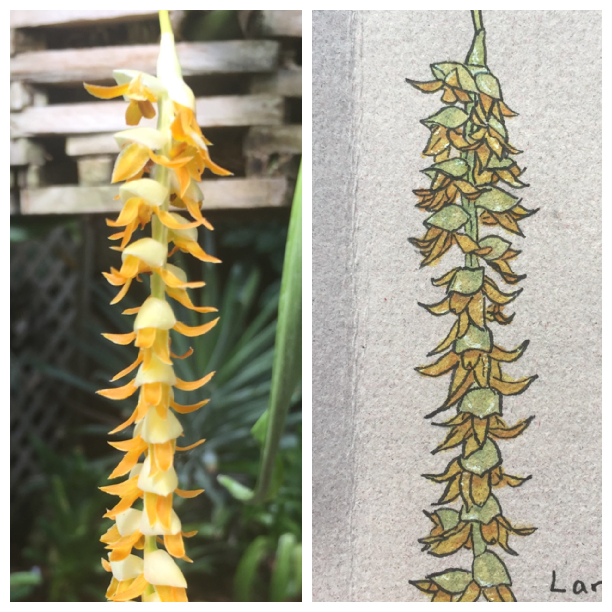
  
  
  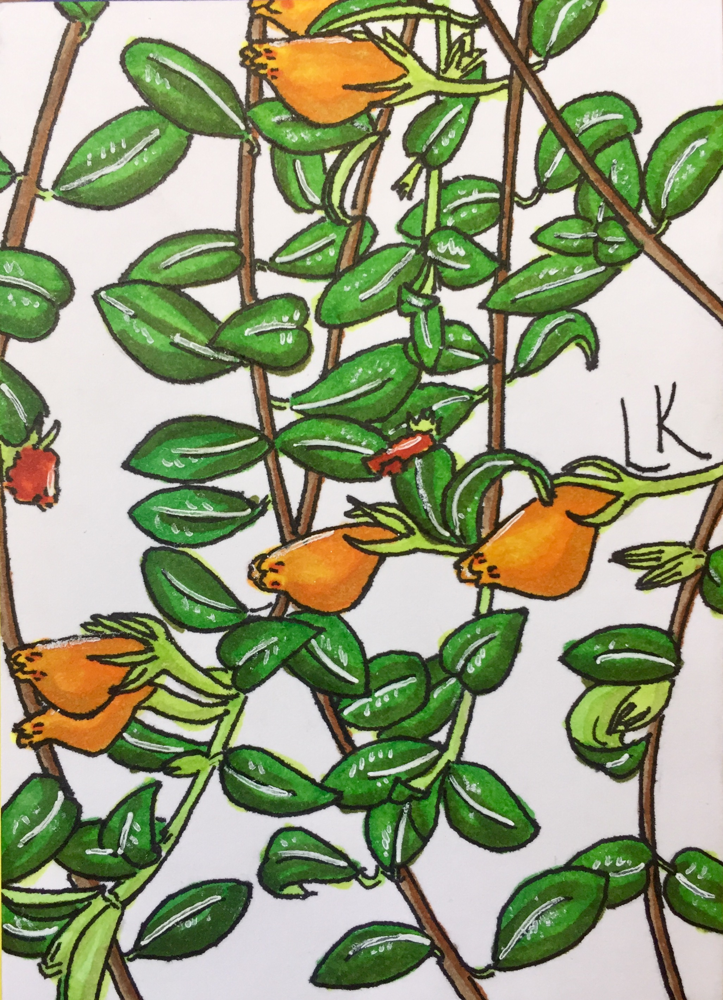
  
  
  
  
  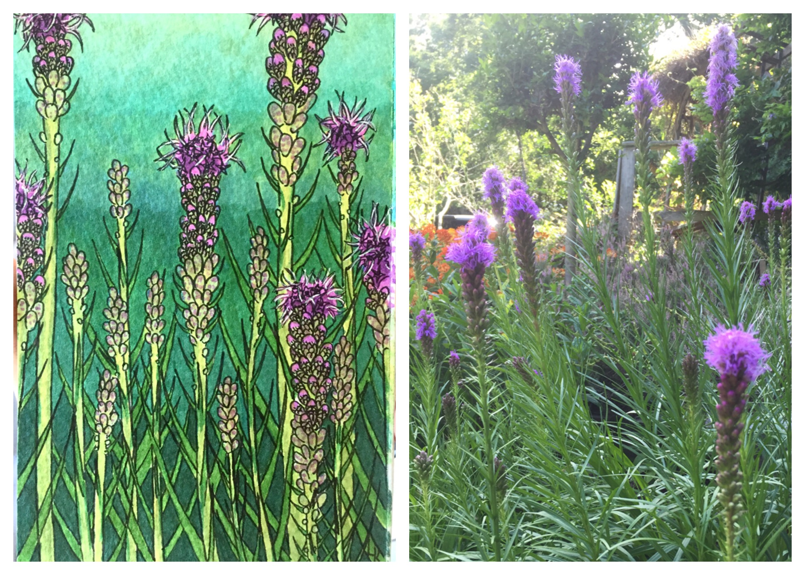
  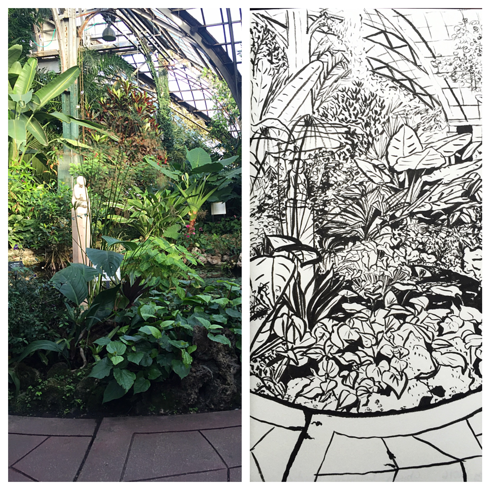
  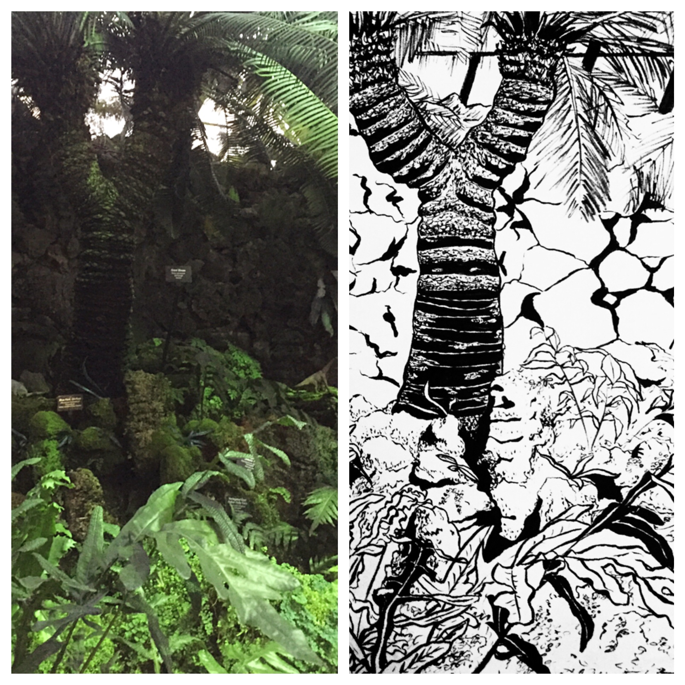
  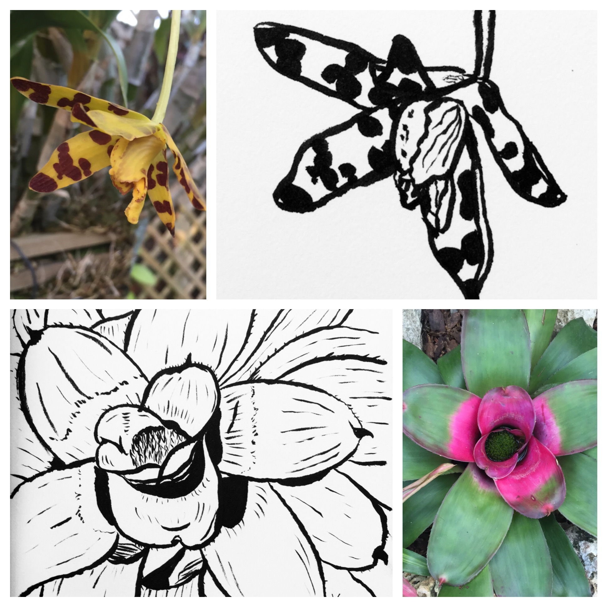
  
  
  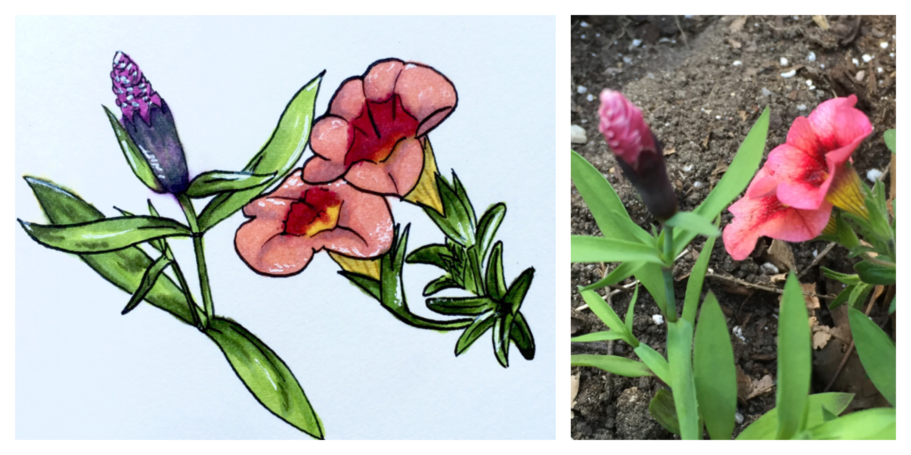
  
  
  
  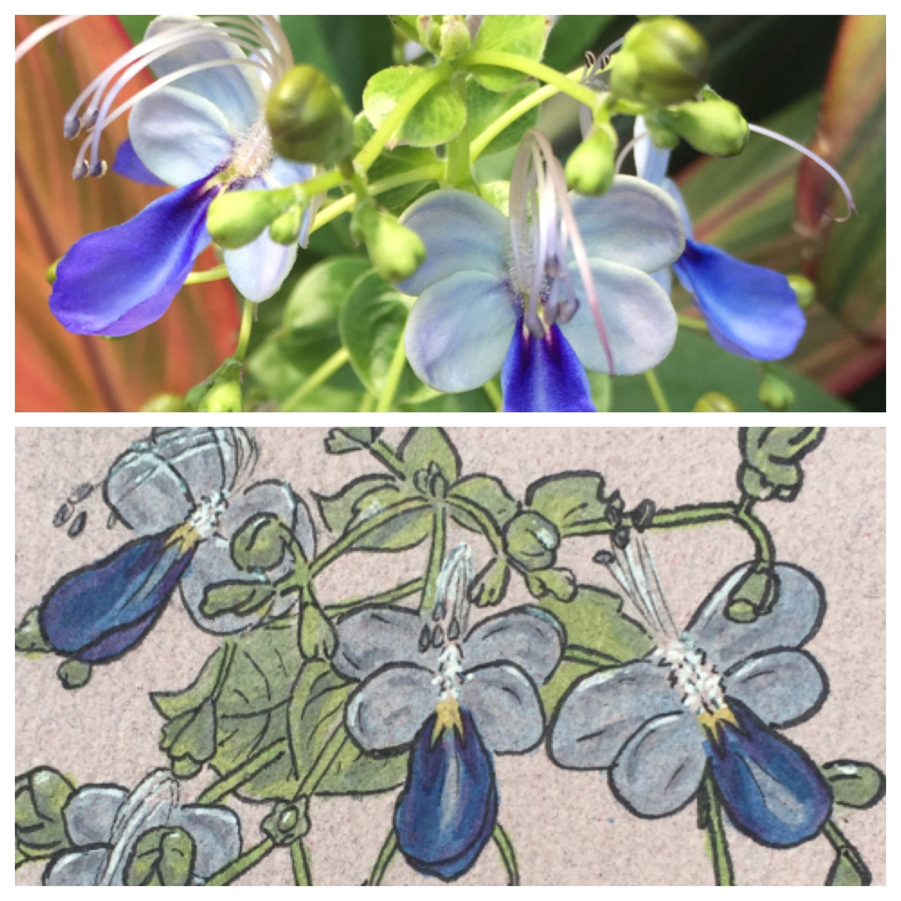
  
  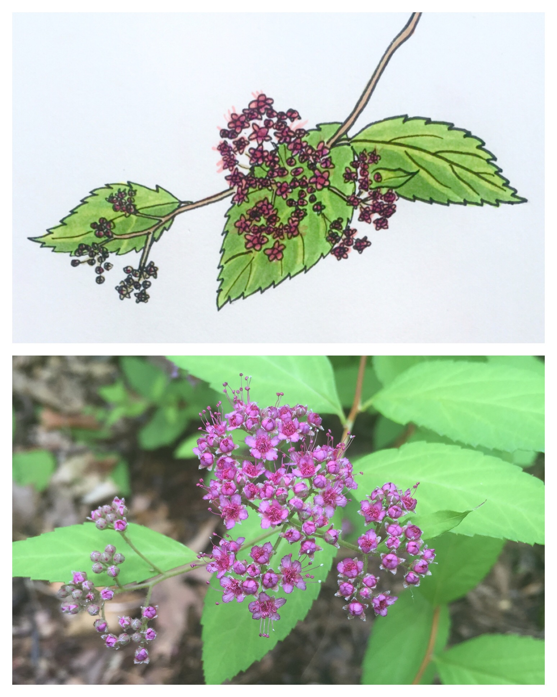
  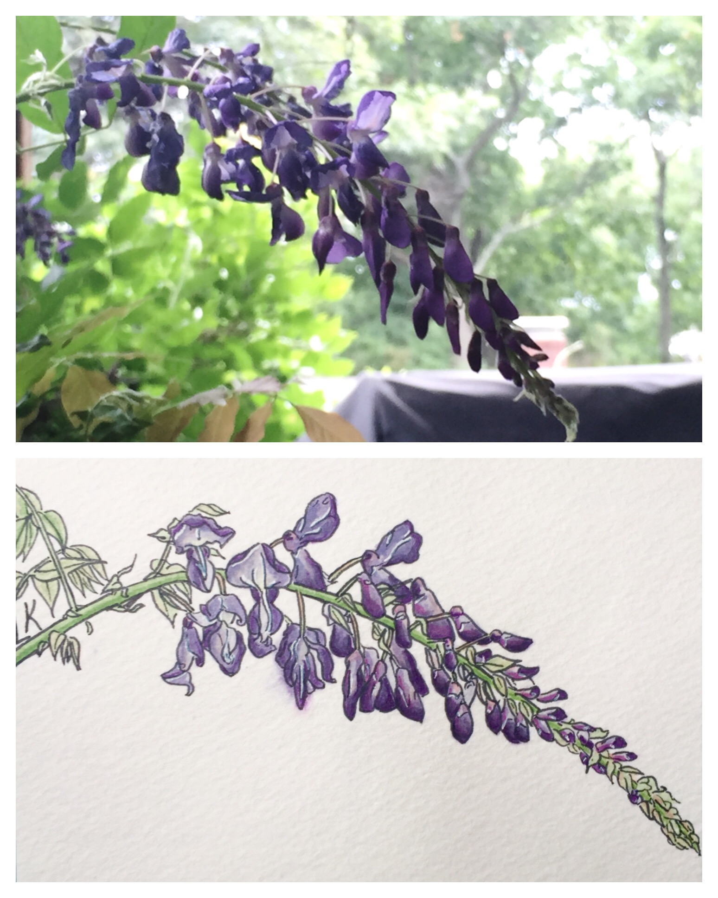
  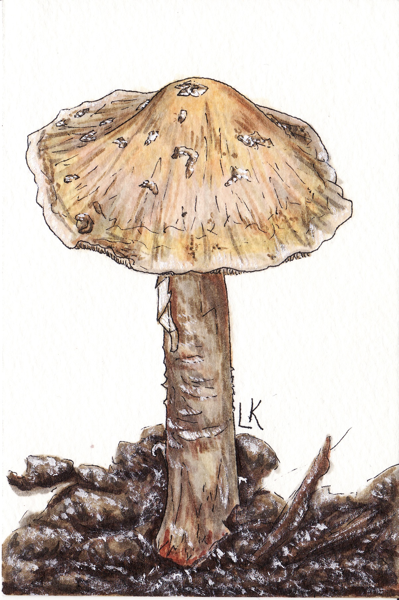
  

